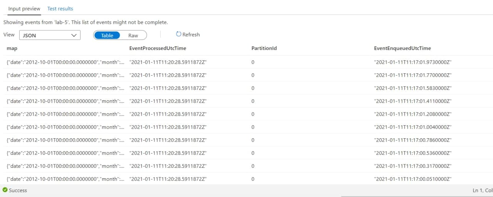

# Prerequisites
  - Акаунт на azure
  - Java
  - Maven
  - Postman

  # Azure Prepararion
> Після створення billing account і відповідного subscription - нам стають доступні resource group та увесь інший функціонал.

1. Створюємо resource group, до якої прив'язуватимуться усі наші сервіси.
2. Створюємо Redis Cache Instance в нашій групі ресурсів. Ключі доступу створюються автоматично.
    
3. Створюємо EventHub namespace.
    
    3a. Створюємо інстанс event Hub.
    3b. В інстансі створюємо Shared access policies та налаштовуємо його на listen або manage
    
 

# Project Customization And Setup
  1. Вставте необхідні дані в файл `src\main\java\com\lab5\denysiuk\StrategyKeys.java`. 
  (REDIS_HOST, REDIS_KEY, CATALOG_NAME, EVENTHUB_NAME_SPACE, EVENTHUB_NAME, SAS_KEY_NAME, SAS_KEY)
  2. Можна запустити аплікацію напряму за допомогою авто-створених InteliJ IDEA конфігів для Spring Boot проекту.
  3. Якщо порт, який використовує сервіс зайнятий, то змінити дефолтний порт можна у `application.properties`, змінивши значення параметрa `server.port`.

# Project Execution
Для завантаження даних в Event Hub або Redis, необхідно виконати POST запит до `localhost:9000/url`. В request body потрібно вставити посилання на json вашого датасету та обрану стратегію.
    

 `Postman` - встановлюємо значення `application/json` для хедера `Content-Type`

Після цього можна запустити наш код і надіслати запит в Postman.

Для перевірки надісланих даних:
  1. Event Hub
  `Ваш Event Hub > Features > Proccess Data > Explore`
  
  2. Redis
  `Ваш Redis Cache > Console > команда hgetAll CATALOG_NAME(береться з дефайнів в коді)`
  )

