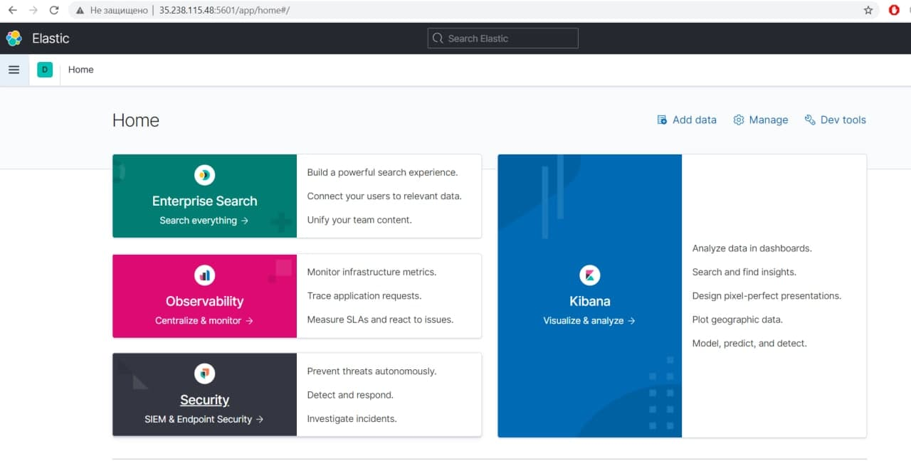
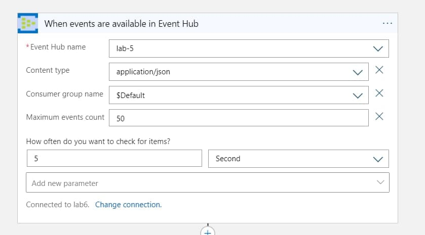

# Prerequisites

- Акаунт на azure
- Акаунт на google cloud

# GCP Preparation

> Після створення billing account - стає доступним увесь функціонал.

1. Створюємо віртуальний образ у сервісі `Compute Engine` з дефолтними налаштуваннями.
2. Після деплою віртуальної машини необхідно налаштувати правила фаєрволу, аби пізніше мати змогу доступатись до нашого
   інстансу по зовнішній IP-адресі, а також для коректного читання Kiban'ою каталогів ElasticSearch'а.
   

   2a. Налаштовуємо рейндж IP-адрес для TCP-портів 9200(ElasticSearch) та 5601(Kibana).
   

    Поки VM запущена, до неї можна доступитися за допомогою external IP, який можна знайти в властивостях інстансу
    

3. Тепер для встановлення необхідного `ELK` стеку логінимось напряму до машини за допомогою `ssh-з'єднання` і виконуємо наступні команди.
   
   3a. Встановлення Java

     ```sh
     $ sudo apt-get install default-jre
     ```
   
   3b. Встановлення ElasticSearch
     ```sh
     $ wget -qO - https://packages.elastic.co/GPG-KEY-elasticsearch | sudo apt-key add -
     $ sudo apt-get install elasticsearch
     $ sudo nano /etc/elasticsearch/elasticsearch.yml 
     # розкоментовуємо рядок network.host і сетаємо для нього значення “0.0.0.0” 
     $ sudo service elasticsearch restart
     ```
   
   3c. Встановлення Logstash
     ```sh
     $ sudo apt-get install apt-transport-https
     $ echo "deb https://artifacts.elastic.co/packages/5.x/apt stable main" | sudo tee -a /etc/apt/sources.list.d/elastic-5.x.list
     $ sudo apt-get update
     $ sudo apt-get install logstash
     $ sudo service logstash start
     ```
   
   3d. Встановлення Kibana
     ```sh
     $ echo "deb http://packages.elastic.co/kibana/5.3/debian stable main" | sudo tee -a /etc/apt/sources.list.d/kibana-5.3.x.list
     $ sudo apt-get update
     $ sudo apt-get install kibana
     $ sudo nano /etc/kibana/kibana.yml
     # розкоментовуємо та вказуємо server.port: 5601 та server.host: “0.0.0.0”
     $ sudo service kibana start
     ```

4. Після усіх кроків перейдіть по `http://<vm-ephemeral-ip>:5601` та `http://<vm-ephemeral-ip>:9200`, аби перевірити чи
   сервіси є в робочому стані.
   
   


   # Azure Preparation

1. Створюємо нову resource group або ж використовуємо попередню, створену під час виконання 5 лабораторної роботи.
2. Створюємо Logic App.
   
   2a. Створюємо початковий тригер для Event Hub, вказавши інтервал перевірки отримання нових даних та максимальну
   кількість об'єктів.

   

   2b. Створюємо також послідовний крок для надсилання HTTP-запиту після отримання даних з відповідним типом запиту та
   вказаною адресою.

   

   
# Execution

Для відображення даних в ElasticSearch та їх візуалізації у Kibana, необхідно затригерити нашу Logic App, завантаживши
нові дані у вказаний Event Hub, таким чином виконається логіка:
`Дані закинуто до Event Hub -> Body кожного івенту, отриманого Event Hub'ом надіслано у вигляді POST запиту до 9200 порту нашої VM -> ElasticSearch створює новий каталог або додає дані у вже існуючий -> Kibana індексує каталог ElasticSearch'a і робить дані доступними для візуалізації`
. Тригер у Logic App потрібно заранити без помилок.

Врешті-решт, дані повинні з'явитись у Index Pattern'і в Kibana:


