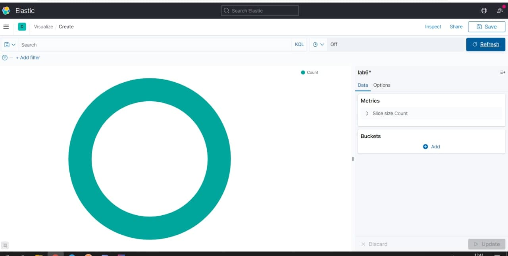
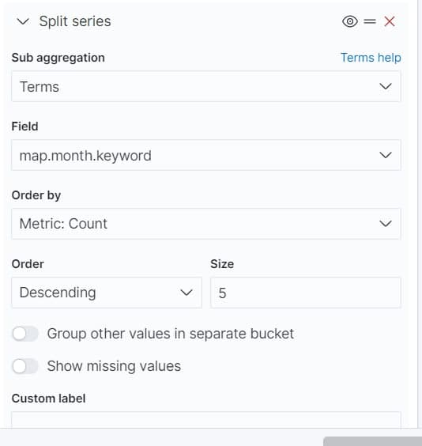
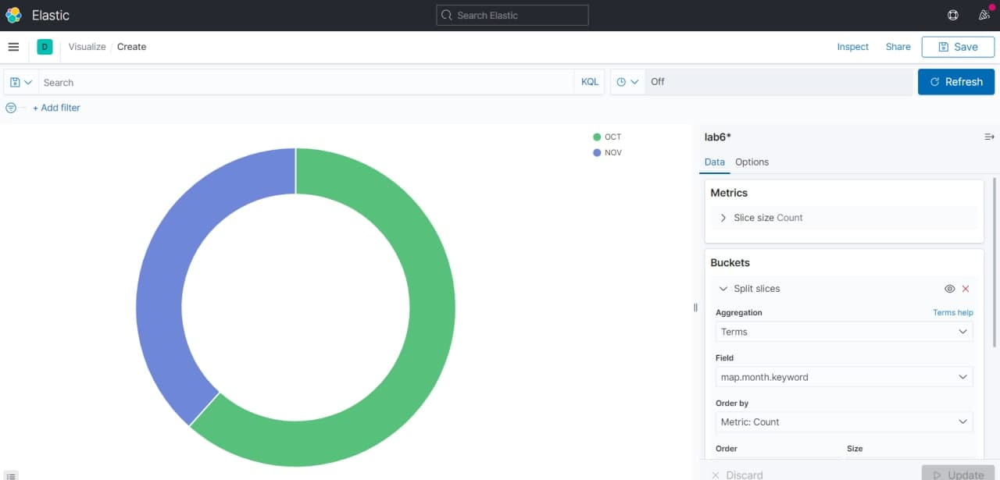
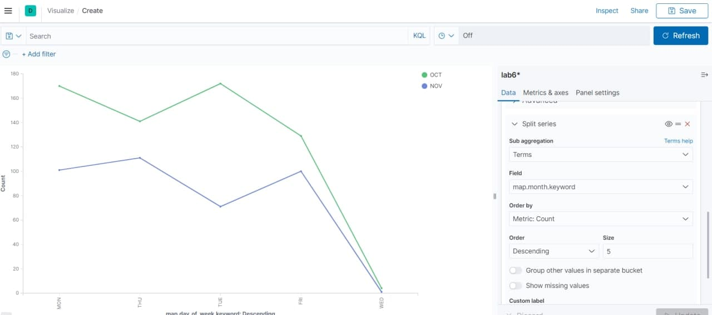
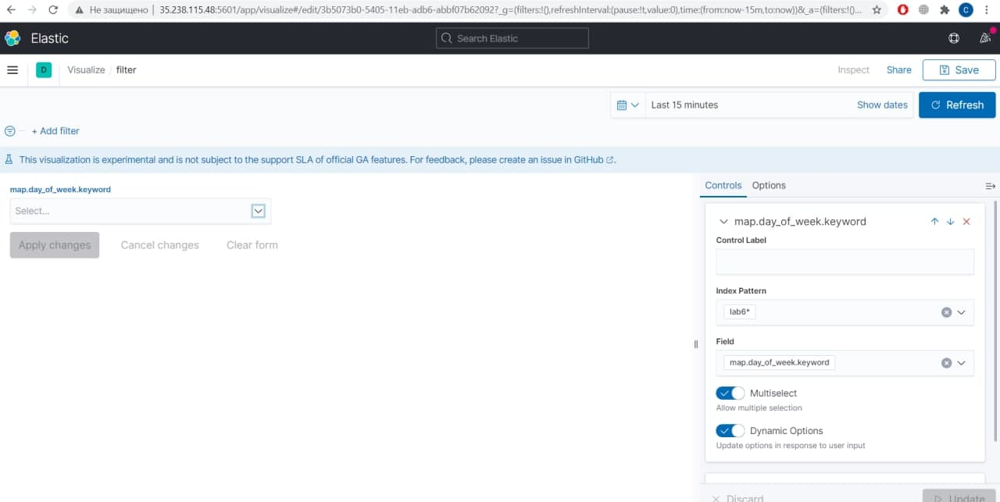
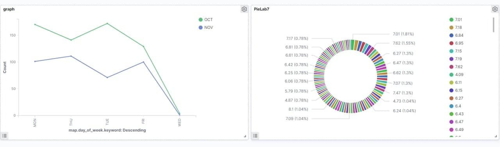
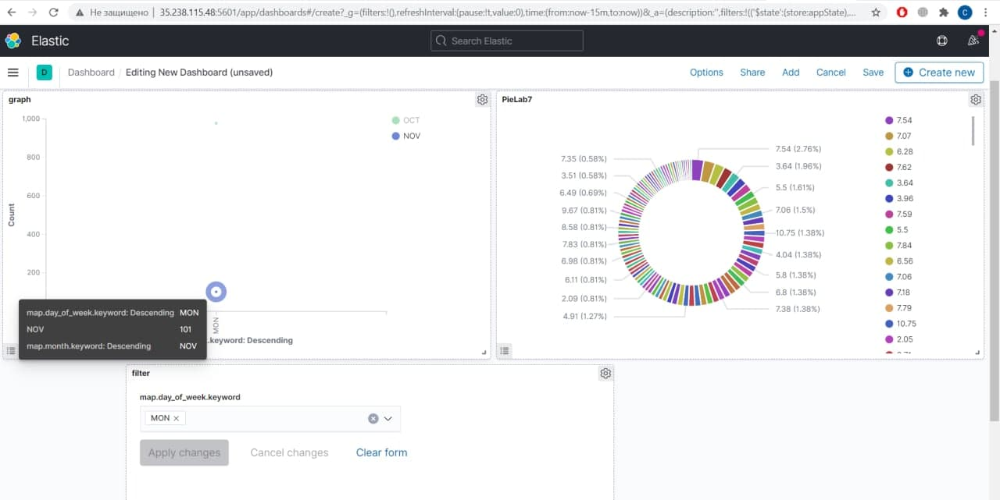

# Prerequisites
  - Робочий інстанс Kibana
  - Існуючий каталог з валідними даними

# Data vizualization
1. Заходимо в розділ Kabana Vizualize.
2. Створюємо нову візуалізацію.
    2a. PieChart
    
    Після створення в нас по дефолту виводиться тільки кількість даних. Щоб це змінити створюємо Bucket.
    
    Результат:
    

    2b. Графік.
    Створюємо графік з бакетом, як на скріні для відображення даних
    

    3c. Фільтр.
    Створюємо фільтр з відповідними контролами
    

3. Створюємо у розділі Dashboard дошку, де будуть обрані нами візуалізації та фільтри, додаємо їх.
    

    Тепер можна додати створений фільтр і фільтрувати дані
    
 
