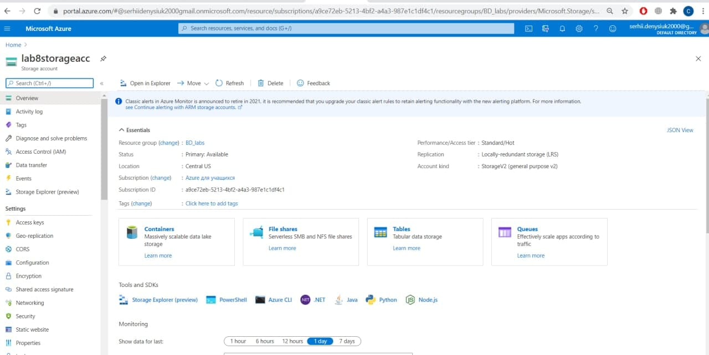
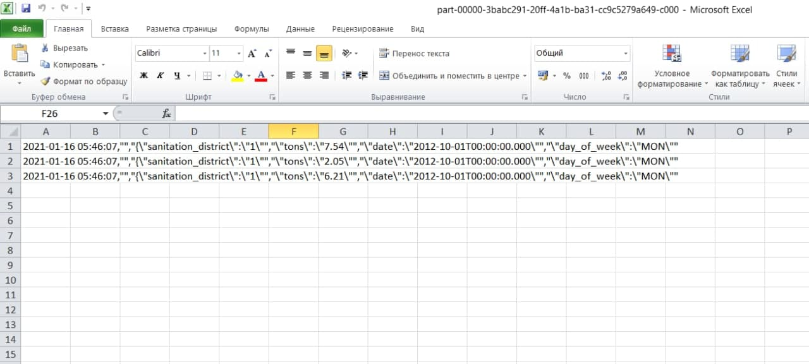

# Prerequisites

- Акаунт на azure
- azure storage explorer

# Для початку потрібно створити необхідні ресурси

1. Створюємо нову ресурс групу або використовуємо існуючу.
2. Створюємо storage account. При створенні в опціях заходимо в вкладку advanced і поле Data Lake storage Gen2 обираємо enabled.

Після створення сторедж аккаунту створюємо контейнер і папку в ньому.


3. Також нам буде потрібен EventHub instance. Можна викоритати з попередніх лабораторних.
4. Створюємо app registrations для надання доступів

В ньому в вкладці certificates & secrets створюємо новий секрет і одразу копіюємо його значення.

В resource group в вкладці IAM додаємо створеному app registration права contributor 


5. Створюємо databricks service. Після створення натискаємо Launch worckspace.

Після переходу створюємо cluster

В кластері встановлюємо бібліотеку maven `com.microsoft.azure:azure-eventhubs-spark_2.11:2.3.18`


Після цього створюємо notebook для коду пайтон та для scala.


В notebook пайтон вставляємо код з файла mounty.py 
В notebook скала вставляємо код з файла eventHub.scala

В відповідні поля mounty.py потрібно вставити свої конфігураційні дані з app registrations
 `client.id` -> `application_id`
 `client.secret` -> secret value який ми створили
 `client.endpoint` потрібно змінити значення перед `/oauth2/token` на `Directory (tenant) ID`

 В `storage` підставляємо імена свого стореджу та контейнеру 


заходимо в azure storage explorer та надаємо до контейнера та папки доступ нашому app registration.


Запускаємо кнопкою Run all в notebook(достатньо один раз)

6. Відкриваємо notebook scala і вставляємо в нього код з eventHub.scala. Тут потрібно замінити відповідні ключі, які ми вставляли в notebook пайтона. 
`client id` - `appid`
`secret` - `password`
`tenantID` - `tenantID`
`fileSystemName` - `container name`, `storageAccountName` - ім'я аккаунт сторедж.
connection string це connection string eventhub space, setEventHubName - ім'я eventHub у який ми записуємо дані.

Далі нам потрібно замінити поля які ми будемо парсити у файлики csv це потрібно змінити у функції filtered в відповідності до даних з датасету, а також у файлі ```EventHubWriter.py``` 

Далі ми вписуємо директорію у яку ми маунтели таку і нам вивело path. Вставляємо у рядок option та start

Після цього потрібно це заранити і отримати повідомлення без помилок 


Пізніше потрібно запустити код на пайтоні. Отримуємо вивід:


Тепер за допомогою Postman потрібно відправити POST запит, як на скріні. Не забуваємо в Connection-Type додати application/json.
В запиті в поле url вставляємо посилання на наш датасет


Після успішного виконання в azure storage explorer в нашій директорії з'являються csv файлики заповлені даними з датасету

